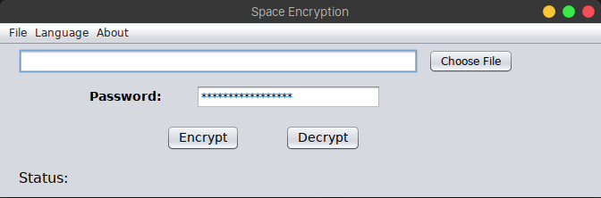

# Space Encryption
## What is it?
Space Encryption is a simple text-file encryption tool.

## Development environment
Here is everything you need to build Space Encryption:
- [NetBeans 11.0](https://netbeans.apache.org/download/nb110/nb110.html) (Optional)
- [Java 12](https://www.oracle.com/technetwork/java/javase/downloads/jdk12-downloads-5295953.html)
- [Ant 1.10.5](https://ant.apache.org/)

## Build & run
To build & run Space Encryption:
- Clone this project or [download zip file](https://github.com/taiprogramer/space-encryption/archive/master.zip)
- If you choose download a zip file, remember to extract
- Follow commands below

|Command|Description|
|---|---|
|`cd space-encryption`|cd into project root directory|
|`ant`|Build|
|`java -jar dist/SpaceEncryption.jar`|Run|

## Tests
This program has been tested with [big-text-file](https://norvig.com/big.txt).

## Contributors
- Nguyen Duy Kha (Inventor)
- taiprogramer (Java GUI Clone)
